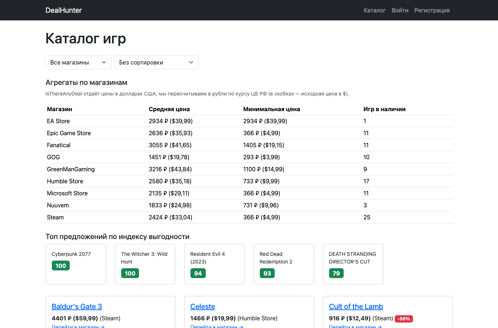
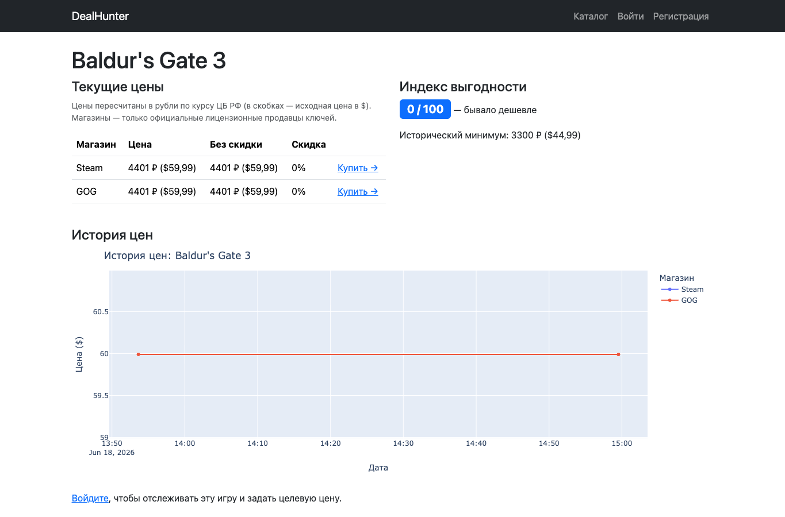
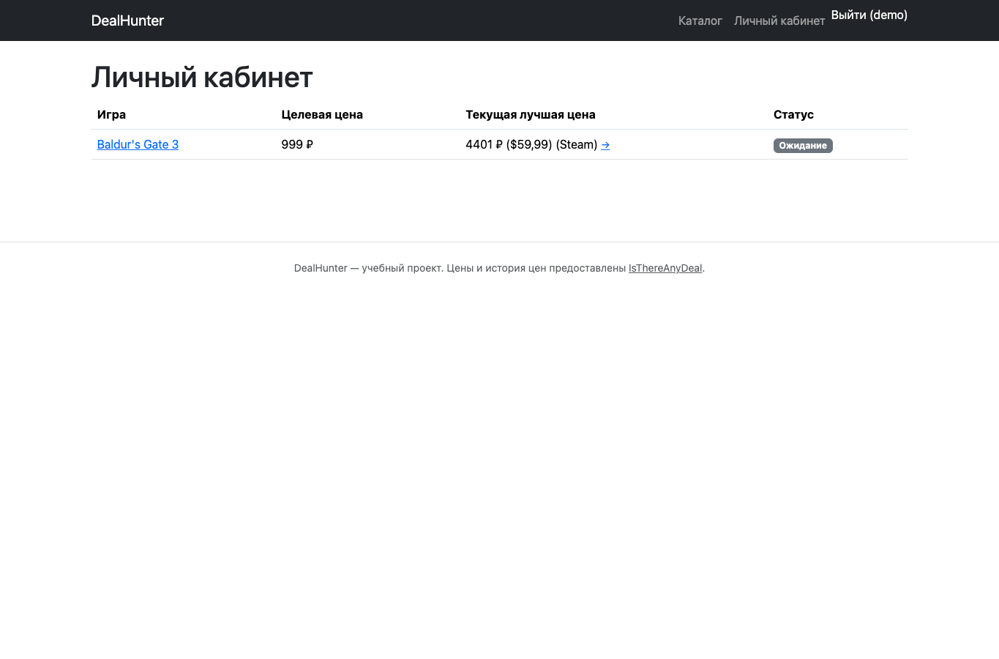

# DealHunter

Веб-сервис для анализа скидок и истории цен на компьютерные игры. Помогает ответить на вопрос
«это правда выгодная цена или нет?», сравнивая текущую цену с историческим минимумом, минимумом
за год и средней ценой, и считая собственный **индекс выгодности (Deal Score)**.

Подробное техническое задание (роли, схема данных, use case'ы, алгоритм Deal Score) — см. [TZ.md](TZ.md).

## Возможности

- Каталог игр с текущими ценами по магазинам, фильтром по магазину и сортировкой по размеру скидки / индексу выгодности.
- Карточка игры: цены по всем магазинам, индекс выгодности с текстовой интерпретацией, интерактивный график истории цен (Plotly).
- Агрегаты по магазинам и топ предложений по индексу выгодности на главной странице (Pandas + Django ORM).
- Личный кабинет: список отслеживаемых игр с целевой ценой и статусом «цель достигнута».
- Регистрация/вход, добавление игры в отслеживание через серверную валидацию формы (Django ModelForm).
- Обновление данных из внешнего источника — IsThereAnyDeal API — через management-команды `seed_catalog` и `update_prices`.
- Админка Django со всеми моделями, поиском и фильтрами.

## Стек

- Python 3.12, Django 5.2
- [IsThereAnyDeal API v2](https://docs.isthereanydeal.com/) (`requests`) — текущие цены, история, исторический минимум
- Pandas — расчёт индекса выгодности (Deal Score) и агрегатов
- Plotly — интерактивный график истории цен
- Bootstrap 5 — вёрстка, наследование шаблонов (``)
- SQLite (разработка)

## Скриншоты


_Каталог игр, фильтры, агрегаты по магазинам и топ предложений по индексу выгодности._


_Карточка игры: текущие цены, индекс выгодности и интерактивный график Plotly._


_Личный кабинет пользователя со списком отслеживания и целевой ценой._

## Локальный запуск

```bash
cd dealhunter
python3.12 -m venv .venv
source .venv/bin/activate
pip install -r requirements.txt
cp .env.example .env
```

В `.env` укажите `SECRET_KEY` (любую случайную строку) и, при наличии, `ITAD_API_KEY`.

```bash
python manage.py migrate
python manage.py createsuperuser
python manage.py runserver
```

Сайт будет доступен на http://127.0.0.1:8000/, админка — на /admin/.

### Получение ключа IsThereAnyDeal API

1. Перейти на https://isthereanydeal.com/apps/my/ и войти/зарегистрироваться.
2. Зарегистрировать новое приложение — будет выдан API-ключ.
3. Указать его в `.env` как `ITAD_API_KEY=...`.

### Наполнение каталога демо-данными

После того как ключ указан в `.env`:

```bash
python manage.py seed_catalog    # создаёт магазины и 26 популярных игр
python manage.py update_prices   # подтягивает текущие цены и историю для каждой игры
```

Команду `update_prices` можно запускать повторно (например, по расписанию через cron) —
она создаёт новые `PriceSnapshot` и пересчитывает флаги достижения целевой цены в списках отслеживания.

## Проверка

```bash
python manage.py check
python manage.py makemigrations --check --dry-run
python manage.py test
```

## Деплой (PythonAnywhere)

1. Загрузить проект на сервер, создать virtualenv с Python 3.10+, `pip install -r requirements.txt`.
2. Создать `.env` на сервере (не коммитится) с `SECRET_KEY`, `DEBUG=False`, `ALLOWED_HOSTS=<домен_приложения>`, `ITAD_API_KEY`.
3. `python manage.py migrate`, `python manage.py collectstatic`.
4. В разделе Web настроить WSGI-файл на `dealhunter.wsgi.application` и указать путь до virtualenv.
5. Настроить статику (`/static/` → `staticfiles/`) в разделе Web.
6. Перезапустить веб-приложение.
