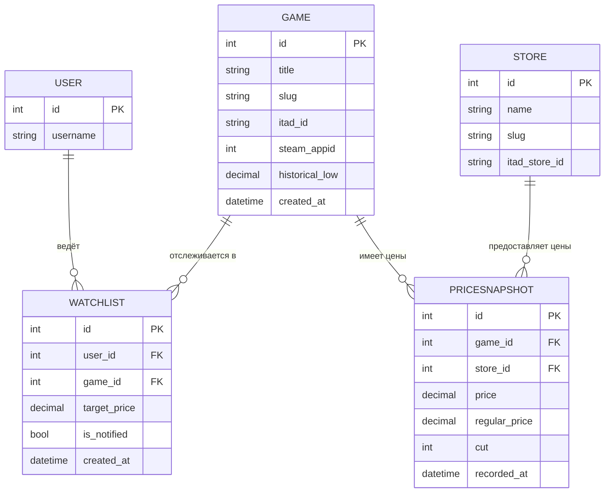

# Техническое задание на проект: «DealHunter — анализатор скидок и истории цен на игры»

## 1. Цель проекта

Веб-сервис для анализа скидок и истории цен на компьютерные игры, помогающий «охотникам за распродажами» принимать обоснованное решение о покупке.

Проблема, которую решает сервис: на игру одновременно действуют разные цены в разных магазинах, а сама по себе «скидка −70%» ничего не говорит о реальной выгоде — магазин мог заранее завысить «старую» цену. Пользователю нужно видеть не рекламный процент, а ответ на вопрос: **«Это правда выгодная цена или нет?»**

Сервис отвечает на этот вопрос так:
- собирает текущие цены по магазинам и историю цен из внешнего источника (IsThereAnyDeal API);
- сравнивает текущую цену с историческим минимумом, минимумом за год и средней ценой;
- рассчитывает собственный **«индекс выгодности» (Deal Score)** и строит график динамики цены;
- позволяет добавить игру в личный список отслеживания с «целевой ценой» и подсвечивает, когда цена опустилась до желаемой.

## 2. Роли пользователей

| Роль | Возможности |
| --- | --- |
| **Гость** | Просмотр каталога игр, страницы игры с текущими ценами по магазинам, графика истории цен, индекса выгодности и общей аналитики (топ-скидки, агрегаты по магазинам). |
| **Авторизованный пользователь** | Всё, что доступно гостю, плюс: ведение личного «Списка отслеживания», установка индивидуальной целевой цены на игру, отметка о том, что цель достигнута, личный кабинет со своими отслеживаниями. |
| **Администратор** | Доступ к Django-админке: управление всеми моделями (игры, магазины, снимки цен, отслеживания), запуск обновления данных, наполнение каталога. |

## 3. Модели данных (сущности)

Минимум 3 связанные кастомные модели. Фактически реализуются 4 (три ядра + пользовательская привязка).

### Модель 1: `Store` (Магазин)
Справочник магазинов, в которых продаются игры (Steam, GOG, Epic, Humble и т.д.).
- `name` — `CharField`, название магазина.
- `slug` — `SlugField`, уникальный идентификатор для URL.
- `itad_store_id` — `CharField`, идентификатор магазина в IsThereAnyDeal.

### Модель 2: `Game` (Игра)
Карточка игры — центральная сущность каталога.
- `title` — `CharField`, название игры.
- `slug` — `SlugField`, для ЧПУ-ссылки на страницу игры.
- `itad_id` — `CharField`, идентификатор игры в IsThereAnyDeal (ключ для запросов к API).
- `steam_appid` — `IntegerField`, ID в Steam (может быть пустым), для ссылок и иконок.
- `historical_low` — `DecimalField`, исторический минимум цены (кэшируется из API).
- `created_at` — `DateTimeField`, дата добавления в каталог.

### Модель 3: `PriceSnapshot` (Снимок цены)
Запись о цене конкретной игры в конкретном магазине на момент проверки. Основа для построения графиков и аналитики. Связана с `Game` и `Store`.
- `game` — `ForeignKey → Game` (`related_name="snapshots"`).
- `store` — `ForeignKey → Store` (`related_name="snapshots"`).
- `price` — `DecimalField`, текущая (со скидкой) цена.
- `regular_price` — `DecimalField`, цена без скидки.
- `cut` — `IntegerField`, размер скидки в процентах.
- `recorded_at` — `DateTimeField`, момент фиксации цены.

### Модель 4: `Watchlist` (Отслеживание)
Персональная настройка мониторинга для авторизованного пользователя. Связана с `User` и `Game`.
- `user` — `ForeignKey → User` (`related_name="watchlist"`).
- `game` — `ForeignKey → Game` (`related_name="watchers"`).
- `target_price` — `DecimalField`, желаемая цена.
- `is_notified` — `BooleanField`, флаг «цель достигнута».
- `created_at` — `DateTimeField`, когда добавлено в отслеживание.

### ER-диаграмма

## 4. Ключевой функционал (User Stories)

1. **Каталог и поиск.** Пользователь открывает каталог, видит список игр с лучшей текущей ценой и размером скидки, может отфильтровать по магазину и отсортировать по размеру скидки или индексу выгодности.
2. **Карточка игры с аналитикой.** Пользователь открывает игру и видит: цены по всем магазинам, исторический минимум, минимум за год, среднюю цену и рассчитанный индекс выгодности (Deal Score) с понятной подписью («отличная цена» / «средне» / «бывало дешевле»).
3. **Визуализация истории цен.** На карточке игры строится интерактивный график динамики цены за период (Plotly) на основе накопленных в БД снимков цен.
4. **Обновление данных из внешнего источника.** Администратор (или management-команда `update_prices`) запрашивает у IsThereAnyDeal актуальные цены и историю, создаёт новые `PriceSnapshot`, обновляет `historical_low` у игр.
5. **Отслеживание целевой цены.** Авторизованный пользователь добавляет игру в список отслеживания и задаёт целевую цену (например, 999 ₽). Система при обновлении сравнивает текущую лучшую цену с целевой и помечает достигнутые цели в личном кабинете.

## 5. Детализация Use Case (для бонуса «Расширенное ТЗ»)

### UC-1. Просмотр аналитики по игре (Гость)
- **Актор:** Гость.
- **Предусловие:** В БД есть игра и хотя бы несколько снимков её цен.
- **Основной сценарий:**
  1. Гость переходит на страницу игры по ЧПУ-ссылке (`/game/<slug>/`).
  2. View собирает все `PriceSnapshot` игры, группирует по магазинам, выбирает актуальные цены.
  3. Аналитический модуль рассчитывает Deal Score и агрегаты (min/avg) средствами Pandas.
  4. Строится график истории цен (Plotly), отдаётся в шаблон.
  5. Гость видит цены, индекс выгодности и график.
- **Альтернатива:** данных по ценам нет → выводится сообщение «данные ещё не собраны».

### UC-2. Добавление игры в отслеживание (Пользователь)
- **Актор:** Авторизованный пользователь.
- **Предусловие:** Пользователь вошёл в аккаунт.
- **Основной сценарий:**
  1. На карточке игры пользователь вводит целевую цену в форму (`WatchlistForm`).
  2. Форма валидируется на сервере (цена > 0, игра ещё не в списке у пользователя).
  3. Создаётся объект `Watchlist`, пользователь видит игру в личном кабинете.
- **Альтернатива:** игра уже в списке → форма возвращает ошибку валидации.

### UC-3. Обновление цен (Администратор / команда)
- **Актор:** Администратор или планировщик.
- **Основной сценарий:**
  1. Запускается `python manage.py update_prices`.
  2. Для каждой игры из каталога делается запрос к ITAD API (по `itad_id`), с задержкой между запросами.
  3. Ответ парсится, создаются `PriceSnapshot`, обновляется `historical_low`.
  4. Пересчитывается `is_notified` у всех `Watchlist`, чьи цели достигнуты.

## 6. Аналитический модуль и алгоритм Deal Score

Модуль `analytics.py` отвечает за «техническую нагрузку» проекта и использует **Pandas** для расчётов и **Plotly** для графиков.

**Алгоритм расчёта индекса выгодности (Deal Score, 0–100):**
1. Загрузить историю цен игры в `pandas.DataFrame`.
2. Вычислить `hist_low` (исторический минимум), `year_avg` (средняя за год), `current` (текущая лучшая цена).
3. Базовая оценка: насколько текущая цена близка к историческому минимуму относительно средней:
   `score = clamp(0, 100, round((year_avg - current) / (year_avg - hist_low) * 100))`
   (если `current == hist_low` → 100; если `current >= year_avg` → ближе к 0).
4. Текстовая интерпретация: ≥80 — «отличная цена», 50–79 — «хорошая», 20–49 — «средняя», <20 — «бывало заметно дешевле».

**Агрегации (Django ORM + Pandas):** средняя/минимальная цена по магазину, количество отслеживающих игру пользователей, топ-N самых выгодных предложений по Deal Score.

**Визуализация:** линейный график динамики цены по датам (Plotly), отдаётся в шаблон как HTML-фрагмент.

## 7. Технический стек и интеграции

- **Backend:** Python 3.10+, Django 5.x.
- **Внешняя интеграция:** [IsThereAnyDeal API v2](https://docs.isthereanydeal.com/) — получение текущих цен, истории и исторических минимумов по играм. Запросы через `requests`. API-ключ хранится в `.env` (`python-dotenv`), **не** попадает в репозиторий.
- **Анализ данных:** Pandas — агрегации и расчёт Deal Score.
- **Визуализация:** Plotly — интерактивные графики истории цен.
- **Frontend:** Bootstrap 5, наследование шаблонов (``), адаптивная вёрстка.
- **БД:** SQLite (разработка), на хостинге допускается SQLite либо PostgreSQL (бонус).
- **Хостинг:** PythonAnywhere (бесплатный тариф; домен `api.isthereanydeal.com` входит в whitelist PA, поэтому живые запросы к API работают).
- **Деплой:** через Git, `DEBUG=False`, `collectstatic`, корректная отдача статики.

### Правила использования ITAD API (соблюдаются в проекте)
- Партнёрские ссылки и данные из API не модифицируются.
- Запросы выполняются по действию пользователя/по расписанию, без массового выкачивания в цикле; результаты кэшируются в БД как `PriceSnapshot`.
- Сервис носит учебно-аналитический характер и не является конкурентом ITAD; источник данных указывается на страницах.

## 8. Изменения в ходе реализации

_Этот раздел заполняется по мере разработки. Сюда вносятся любые отклонения от плана (например, замена источника данных, изменение полей моделей, упрощение/усложнение алгоритма Deal Score) с краткой причиной._

- _(пока изменений нет)_
